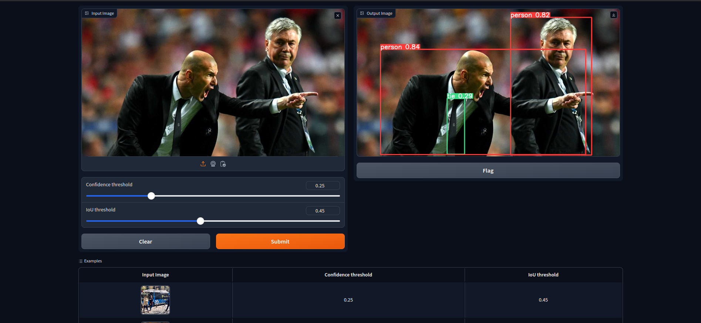

<div align="center">

# Object Detection Gradio

[](https://github.com/pre-commit/pre-commit)
[](https://pytorch.org/get-started/locally/)


This is a simple example of object detection using Gradio and PyTorch.
</div>

## 📌 Feature
- [x] Gradio UI implemented
- [x] yolov8n model used
- [x] Dockerized
- [x] Moduler code
- [ ] FastAPI server implementation
- [ ] Streaming support

## 📁  Project Structure
The directory structure of new project looks like this:

```
├── configs
│   └── config.toml
├── images
├── main.py
├── README.md
├── requirements.txt
└── src
   ├── app.py
   ├── core
   │   ├── __init__.py
   │   └── yolov8.py
   ├── __init__.py
   ├── pylogger
   │   ├── __init__.py
   │   └── logger.py
   ├── server
   │   ├── __init__.py
   │   └── server.py
   └── utils
       ├── config.py
       ├── __init__.py
       ├── logger.py
       ├── models.py
       └── textformat.py

```

## 🚀 Getting Started

### Step 1: Clone the repository
```bash
git clone https://github.com/sh-aidev/object-detection-demo.git
cd object-detection-demo
```

### Step 2: Open inside docker container in vscode

```bash
code .
```
**NOTE**: Once repo in opened in vscode, it will ask to open in container. Click on reopen in container. It will take some time to build the container.

### Step 3: Install the required dependencies

```bash
python3 -m pip install -r requirements.txt
```

### Step 4: Run the server

```bash
python3 main.py
```

## 📝  Usage Example Page:
- Open the browser and go to `http://localhost:8080/` to see the gradio UI.
- Upload the image and click on predict button to see the object detection.



## 📜  References
- [Gradio](https://docs.ultralytics.com/integrations/gradio/#usage-example)
- [PyTorch](https://pytorch.org/get-started/locally/)
- [Docker](https://docs.docker.com/get-started/)


